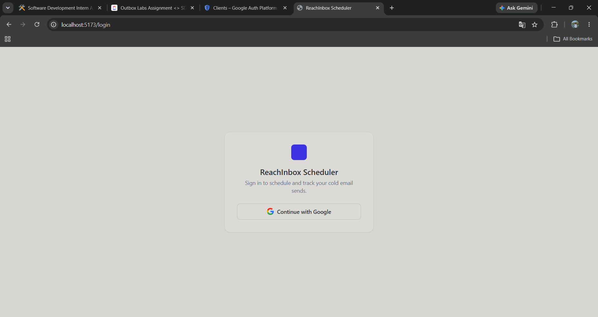
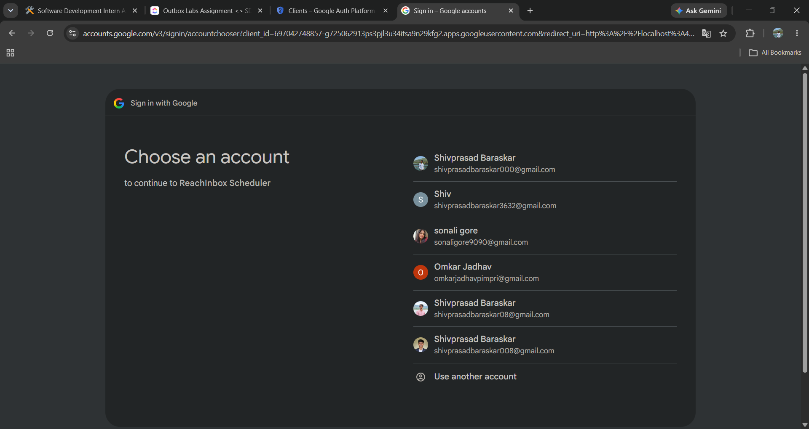
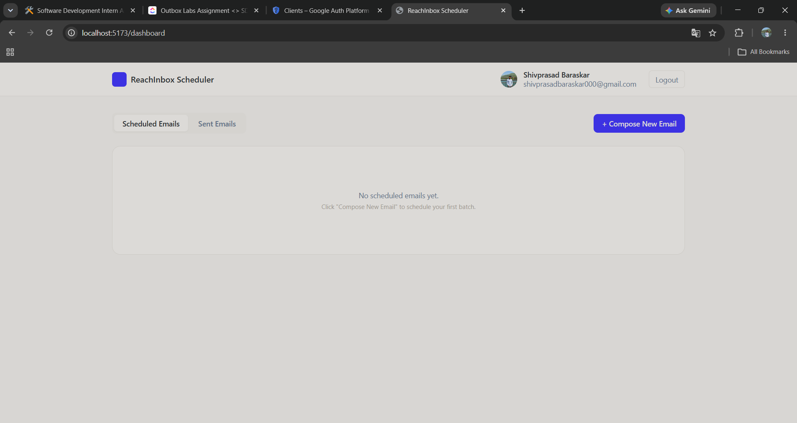
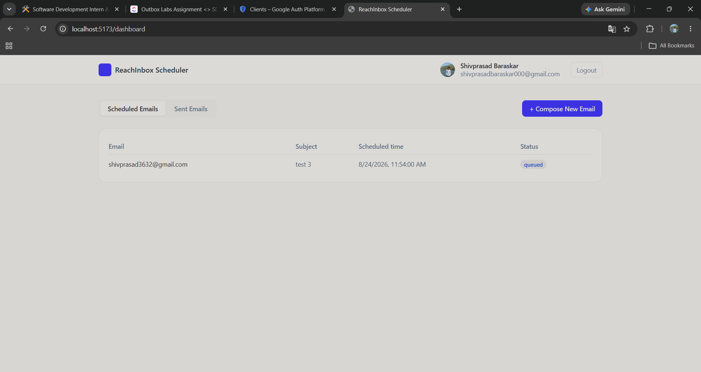
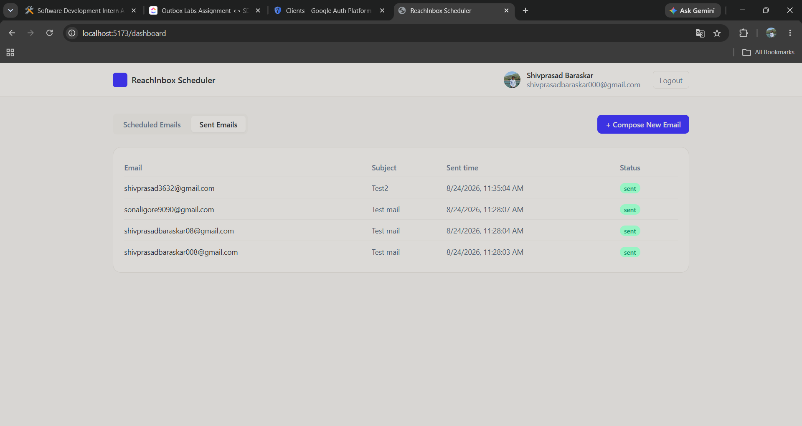
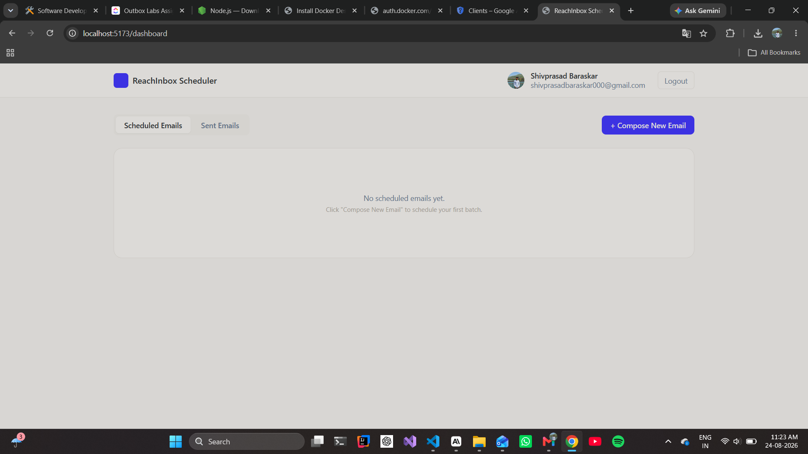
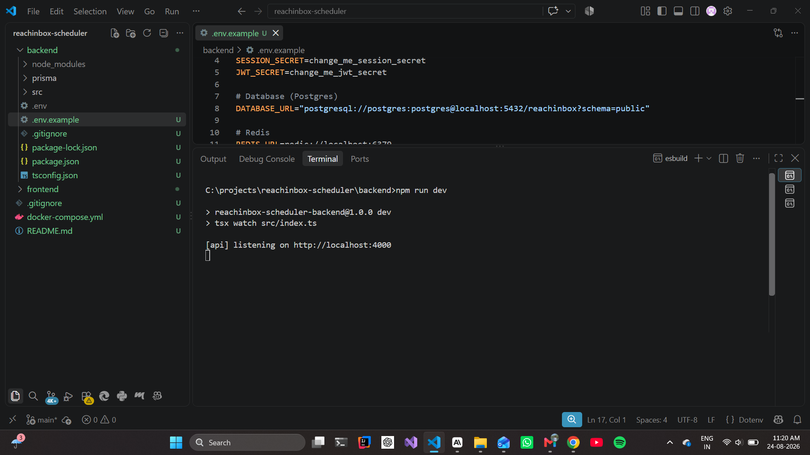

# ReachInbox Scheduler — Full-Stack Email Job Scheduler

A production-shaped email scheduling service: schedule sends via API/UI, deliver
them at the right time with **BullMQ delayed jobs (no cron)**, survive restarts,
and enforce per-sender hourly rate limits + a minimum delay between sends —
backed by Redis counters so it stays correct across multiple worker processes.

```
reachinbox-scheduler/
├── backend/     Express + TypeScript API, BullMQ worker, Prisma/Postgres
├── frontend/    React + TypeScript + Tailwind dashboard (Vite)
├── docs/screenshots/    Screenshots referenced in this README
└── docker-compose.yml   Postgres + Redis for local dev
```

## Screenshots

**Login → Google sign-in → Dashboard, end to end:**

| 1. Login page | 2. Google account chooser |
|---|---|
|  |  |

| 3. Dashboard (empty state) | 4. Scheduled Emails (after Compose) |
|---|---|
|  |  |

| 5. Sent Emails (once the worker delivers them) |
|---|
|  |

**Backend processes running:**

| API server | BullMQ worker |
|---|---|
|  |  |

## 1. Prerequisites

- Node.js 18+
- Docker (recommended, for Postgres + Redis) — or your own local instances
- A Google Cloud OAuth 2.0 Client ID (Web application) for login

## 2. Start infra

```bash
docker compose up -d       # postgres:5432, redis:6379
```

## 3. Backend

```bash
cd backend
cp .env.example .env       # fill in GOOGLE_CLIENT_ID / GOOGLE_CLIENT_SECRET
npm install
npm run prisma:generate
npm run prisma:migrate     # creates tables in Postgres
npm run dev                # API on http://localhost:4000
```


In a **second terminal**, start the worker (separate process, as in a real deployment):

```bash
cd backend
npm run worker             # BullMQ worker on the email-send queue
```


### Ethereal Email (fake SMTP)

You don't have to set anything up manually — if `ETHEREAL_USER`/`ETHEREAL_PASS`
are left blank in `.env`, the worker calls `nodemailer.createTestAccount()` on
first send and logs the generated inbox credentials + a preview URL for every
email it sends. If you'd rather pin a fixed account, create one at
https://ethereal.email and paste the credentials into `.env`.

### Google OAuth setup

1. In Google Cloud Console → APIs & Services → Credentials, create an
   **OAuth 2.0 Client ID** (type: Web application).
2. Authorized redirect URI: `http://localhost:4000/auth/google/callback`
3. Authorized JavaScript origin: `http://localhost:5173`
4. Copy the Client ID/Secret into `backend/.env`.

## 4. Frontend

```bash
cd frontend
cp .env.example .env       # VITE_API_URL=http://localhost:4000
npm install
npm run dev                # UI on http://localhost:5173
```

Visit `http://localhost:5173` — you'll land on the login page and sign in with Google:


You land on the dashboard:


Click **+ Compose New Email**, fill in subject/body, upload a CSV/text file of
leads, set a start time, and hit **Schedule**. The batch shows up immediately
under **Scheduled Emails** with status `queued`:


Once each job's due time arrives, the worker sends it via Ethereal and the row
moves to **Sent Emails**:


---

## Architecture

### How scheduling works (no cron)

- `POST /schedule` accepts a subject/body, a CSV/text file of leads, a start
  time, a delay-between-sends, and an hourly cap.
- `services/scheduler.ts` plans a `scheduledAt` for every recipient up front:
  it round-robins recipients across the configured senders
  (`DEFAULT_SENDERS`) and walks each sender forward in `delayMs` steps,
  jumping to the next hour boundary once that sender's planned hourly cap is
  hit. This gives the dashboard a sane "Scheduled time" immediately.
- Each recipient becomes an `EmailJob` row in Postgres, and a **BullMQ
  delayed job** (`queues/emailQueue.ts`) is added with
  `delay = scheduledAt - now`. BullMQ stores that delay in Redis and moves
  the job to the wait queue itself when it's due — there's no cron, no
  polling loop, no `setTimeout` that dies with the process.

### Persistence across restarts

- BullMQ's state (waiting/delayed/active jobs) lives in **Redis**, not in
  process memory. If the API or worker process restarts, delayed jobs are
  still sitting in Redis with their original due time and fire exactly when
  due — nothing needs to be "resumed" manually.
- The `EmailJob` row in Postgres is the source of truth for status. Before
  actually sending, the worker re-checks `record.status === "sent"` — so
  even a crash-and-redeliver of the same BullMQ job (e.g. after a hard kill
  mid-send) can't double-send.
- **Idempotency**: the BullMQ `jobId` is set to the `EmailJob.id` (a UUID).
  BullMQ silently ignores `queue.add()` calls that reuse an existing jobId,
  so re-running the schedule request, or any retry logic, can never create a
  duplicate job for the same email.

### Rate limiting & concurrency

- **Worker concurrency**: `WORKER_CONCURRENCY` (env, default 5) controls how
  many jobs the BullMQ `Worker` processes in parallel.
- **Minimum delay between sends**: `MIN_DELAY_MS_BETWEEN_SENDS` (env, default
  2000ms = 2s between sends). Enforced two ways: a BullMQ `limiter` (`max: 1`
  job dispatched per `MIN_DELAY_MS_BETWEEN_SENDS`) throttles the whole
  queue, and the worker also tracks `lastSendAt` locally as a belt-and-braces
  check.
- **Hourly cap per sender**: `MAX_EMAILS_PER_HOUR_PER_SENDER` (env, default
  200). Enforced by `services/rateLimiter.ts`, which uses a Redis key
  `rate:{sender}:{hourWindowStartMs}` and a **Lua script** that atomically
  reads-and-increments — safe even with multiple worker instances hammering
  the same key concurrently, since Redis executes the script as one atomic
  unit (no separate GET-then-INCR race).
- **When the hourly limit is hit**: the job is **not dropped or failed**. The
  worker calls `job.moveToDelayed(nextHourWindowStart, token)` (BullMQ's
  documented pattern via `DelayedError`) to push the *same* job — same
  jobId, no duplication — to the start of the next hour window, and updates
  the DB row to `status: "rescheduled"` so the dashboard reflects it.
- **1000+ jobs scheduled at once**: since scheduling just enqueues N delayed
  BullMQ jobs (no in-memory loop holding them all), this scales the same way
  whether it's 10 or 10,000 — Redis holds the delayed set, and the worker's
  concurrency + limiter + hourly cap naturally throttle actual send
  throughput regardless of how many jobs are "due" at once.

### Auth

- Google OAuth 2.0 via Passport (`passport-google-oauth20`). On successful
  login the backend issues a short-lived JWT in an httpOnly cookie; all API
  routes other than `/auth/*` require it (`middleware/requireAuth.ts`).

---

## Features implemented

**Backend**
- [x] Email scheduling API (`POST /schedule`, multipart CSV upload)
- [x] BullMQ delayed jobs, no cron
- [x] Restart-safe persistence (Redis-backed queue + DB status checks)
- [x] Idempotent sends (jobId = DB row id, status check before send)
- [x] Configurable worker concurrency
- [x] Configurable minimum delay between sends
- [x] Configurable, Redis-backed, multi-sender hourly rate limiting
- [x] Graceful reschedule (not drop) when hourly limit is hit
- [x] Google OAuth login/logout, JWT session cookie
- [x] `GET /emails/scheduled`, `GET /emails/sent`

**Frontend**
- [x] Google login page
- [x] Dashboard: header with user info + logout, Scheduled/Sent tabs
- [x] Compose modal: subject, body, CSV upload with detected-email count,
      start time, delay, hourly limit
- [x] Scheduled/Sent tables with loading and empty states
- [x] Polling refresh so the dashboard reflects worker activity

## Assumptions, shortcuts, trade-offs

- **Senders**: the assignment says "you will have to support multiple
  senders" but doesn't specify how a sender is chosen per email — I
  round-robin recipients across a configurable `DEFAULT_SENDERS` list rather
  than exposing sender selection in the UI, to keep Compose focused on what
  the Figma-described flow asks for (subject/body/leads/timing/limits).
- **Figma**: no Figma link was reachable from the assignment doc I was
  given, so the dashboard/compose UI follows the written spec (header,
  tabs, compose modal, tables with loading/empty states) rather than a
  pixel-accurate match — swap in real design tokens if you share the file.
- **CSV parsing**: `extractEmails()` scans every cell of the uploaded
  file for anything email-shaped, so it works whether the file is a bare
  list of addresses or a CSV with a header row and an `email` column,
  without requiring a specific column name.
- **Planning-time schedule vs. runtime enforcement**: `scheduledAt` shown in
  the dashboard is computed once at Compose time as an estimate; the Redis
  rate limiter is the actual source of truth at send time and can push a
  job later (reflected as `rescheduled`) if reality diverges from the plan.
- Retry policy on transient send failures: BullMQ's built-in
  `attempts: 5` + exponential backoff, not a custom implementation.
